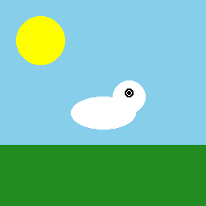

# HorseShooter 🐴💥

A slapstick comedy 2D Android game where you run around shooting cartoon horses with googly eyes. Built with Godot 4.3!



## 🎮 Gameplay

- **Move**: WASD or Arrow keys (on mobile: touch joystick)
- **Shoot**: Click or Spacebar
- **Objective**: Score points by hitting cartoon horses

### Slapstick Comedy Style

The game features cartoonish, non-violent comedy:
- 🐴 Horses with exaggerated googly eyes
- 💨 Smoke puff explosions with starbursts
- 👻 Death animation: horses spin, shrink, and float up like cartoon ghosts
- 💬 Comic text effects: "KA-BOOM!", "POW!", "SPLAT!", "WHAM!", "ZAP!"
- 🔊 Funny sound effects: boings, splats, and pew-pew lasers

## 🏆 Features

- 4 different horse colors (brown, white, gray, black)
- Score tracking with high score persistence
- Retro pixel art style
- 8-bit style sound effects
- Android touch controls
- Procedurally generated assets

## 🛠️ Built With

- **Engine**: Godot 4.3
- **Language**: GDScript
- **Graphics**: Python/PIL (procedurally generated sprites)
- **Audio**: Python/wave (procedurally generated SFX)
- **Platform**: Android (ARM64)

## 📁 Project Structure

```
HorseShooter/
├── assets/
│   ├── sprites/      # Pixel art sprites (PNG)
│   └── sounds/       # Sound effects (WAV)
├── scenes/           # Godot scene files (.tscn)
├── src/              # GDScript source files
├── android/          # Android build template
├── generate_sprites.py   # Sprite generation script
├── generate_sounds.py    # Sound generation script
└── project.godot    # Godot project file
```

## 🚀 Building

### Prerequisites
- Godot 4.3+
- Android SDK
- OpenJDK 17

### Build for Android
```bash
# Export from Godot editor or CLI
godot --headless --export-release "Android" export/HorseShooter.apk
```

### Generate Assets
```bash
# Generate sprites
python3 generate_sprites.py

# Generate sounds
python3 generate_sounds.py
```

## 📱 Installation

Download the APK from releases and install on Android:
```bash
adb install export/HorseShooter.apk
```

## 📝 License

This project is open source. Feel free to modify and distribute!

## 🎯 Scoring

- Each horse: **100 points**
- High score is saved automatically
- Accuracy tracking (horses hit / horses spawned)

---

**Made with ❤️ using free, open-source tools!**
